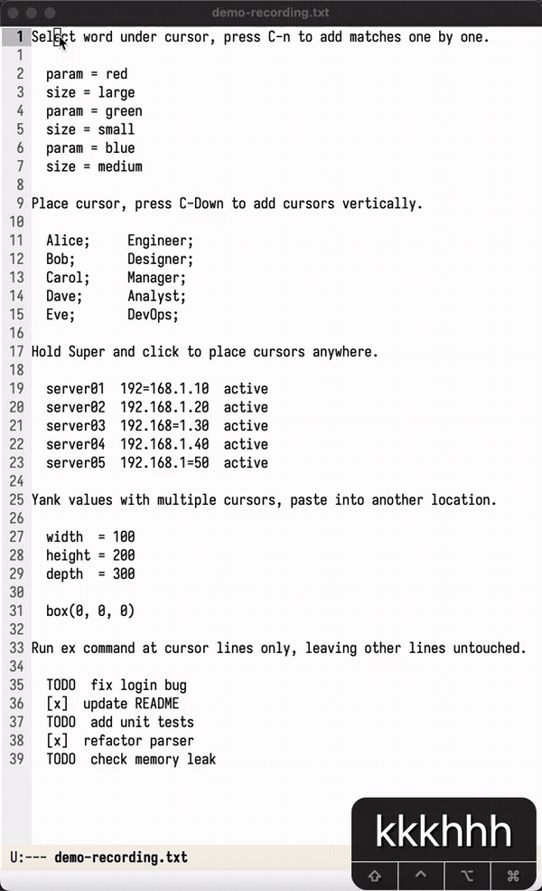

#+TITLE: Evil Visual Multi (evim)
#+AUTHOR: Vadim Pavlov
#+OPTIONS: toc:3

Multiple cursors for evil-mode, inspired by [[https://github.com/mg979/vim-visual-multi][vim-visual-multi]].

* Features

- Two modes: *cursor mode* (point cursors, operators need motions) and *extend mode* (selections, operators act directly)
- Leader cursor with distinct highlighting
- Per-cursor registers for yank/paste (1-to-1 distribution)
- Evil movements, text objects, and operators at all cursors
- evil-surround integration (=S=, =ys=, =ds=, =cs=)
- Run normal commands, macros, or ex commands at all cursors
- Restriction: limit search to a region
- Undo/redo with automatic cursor resync
- Theme-aware faces with auto-adaptation

* Installation

** MELPA (recommended)

#+begin_src emacs-lisp
(use-package evim
  :after evil
  :config
  (evim-setup-global-keys))
#+end_src

** Doom Emacs

In =packages.el=:

#+begin_src emacs-lisp
(package! evim)
#+end_src

In =config.el=:

#+begin_src emacs-lisp
(use-package! evim
  :after evil
  :config
  (evim-setup-global-keys))
#+end_src

Then run =doom sync= and restart Emacs.

Doom may rebind some keys used by evim (e.g. =C-n=, =C-Down=, =C-Up=).
If you encounter conflicts, override them in =config.el=:

#+begin_src emacs-lisp
;; Example: unbind C-n in Doom before evim takes over
(map! :n "C-n" nil)
#+end_src

Before the package is on MELPA, install directly from GitHub:

#+begin_src emacs-lisp
;; packages.el
(package! evim :recipe (:host github :repo "chestnykh/multi-cursor-evil"))
#+end_src

** Manual

Clone the repository, add it to =load-path=, and set up keys:

#+begin_src emacs-lisp
(add-to-list 'load-path "/path/to/multi-cursor-evil")
(require 'evim)
(evim-setup-global-keys)
#+end_src

* Quick Start

1. Place cursor on a word, press =C-n= --- the word is selected
2. Press =n= to add the next match, =q= to skip, =Q= to remove
3. Press =Tab= to switch between cursor/extend mode
4. Edit at all cursors: =c=, =d=, =i=, =a=, =r=, etc.
5. Press =Esc= to exit evim

* Keybindings

The default leader key is =\= (backslash). Customise with =evim-leader-key=.

** Activation (evil normal/visual state)

| Key         | Command                     | Description                       |
|-------------+-----------------------------+-----------------------------------|
| =C-n=       | =evim-find-word=             | Select word under cursor, enter evim |
| =C-Down=    | =evim-add-cursor-down=       | Add cursor on line below          |
| =C-Up=      | =evim-add-cursor-up=         | Add cursor on line above          |
| =s-mouse-1= | =evim-add-cursor-at-click=  | Add cursor at click position      |
| =\ g S=    | =evim-reselect-last=         | Reselect last evim session         |
| =\ c=      | =evim-visual-cursors=        | Create cursors from visual selection (visual state) |
| =\ r=      | =evim-toggle-restrict=       | Set restriction from visual selection (visual state) |

** General (active in both modes)

| Key       | Command                 | Description                        |
|-----------+-------------------------+------------------------------------|
| =Esc=     | =evim-exit=              | Exit evim                           |
| =Tab=     | =evim-toggle-mode=       | Toggle cursor/extend mode          |
| =n=       | =evim-find-next=         | Add next match                     |
| =N=       | =evim-find-prev=         | Add previous match                 |
| =]=       | =evim-goto-next=         | Move leader to next cursor         |
| =[=       | =evim-goto-prev=         | Move leader to previous cursor     |
| =q=       | =evim-skip-current=      | Skip leader, add next match        |
| =Q=       | =evim-remove-current=    | Remove leader cursor               |
| =C-n=     | =evim-add-next-match=    | Add next pattern match             |
| =s-mouse-1= | =evim-add-cursor-at-click= | Add cursor at click            |
| =M=       | =evim-toggle-multiline=  | Toggle multiline search            |
| ="=       | =evil-use-register=     | Select register for next yank/paste |

** Leader-prefixed (\ + key)

| Key     | Command              | Description                            |
|---------+----------------------+----------------------------------------|
| =\ A=  | =evim-select-all=     | Select all matches of current pattern  |
| =\ a=  | =evim-align=          | Align cursors by inserting spaces      |
| =\ r=  | =evim-toggle-restrict= | Toggle search restriction             |
| =\ g S= | =evim-reselect-last= | Reselect last evim session             |
| =\ z=  | =evim-run-normal=     | Run normal command at all cursors      |
| =\ @=  | =evim-run-macro=      | Run macro from register at all cursors |
| =\ :=  | =evim-run-ex=         | Run ex command at all cursor lines     |

** Cursor Mode

*** Motions

| Key   | Command                       | Description               |
|-------+-------------------------------+---------------------------|
| =h/j/k/l= | =evim-{backward,next,previous,forward}-*= | Basic movement |
| =w/b/e= | =evim-forward-word= / =backward-word= / =forward-word-end= | Word motions |
| =0= / =^= / =$= | =evim-beginning-of-line= / =first-non-blank= / =end-of-line= | Line motions |
| =f/t/F/T= | =evim-find-char*=           | Character search          |

*** Insert

| Key | Command           | Description                |
|-----+-------------------+----------------------------|
| =i= | =evim-insert=     | Insert before cursor       |
| =a= | =evim-append=     | Insert after cursor        |
| =I= | =evim-insert-line= | Insert at line start      |
| =A= | =evim-append-line= | Insert at line end        |
| =o= | =evim-open-below= | Open line below            |
| =O= | =evim-open-above= | Open line above            |

*** Operators (wait for motion/text object)

| Key   | Command                  | Description              |
|-------+--------------------------+--------------------------|
| =d=   | =evim-operator-delete=    | Delete                   |
| =c=   | =evim-operator-change=    | Change (delete + insert) |
| =y=   | =evim-operator-yank=      | Yank                     |
| =D=   | =evim-delete-to-eol=      | Delete to end of line    |
| =C=   | =evim-change-to-eol=      | Change to end of line    |
| =Y=   | =evim-yank-line=          | Yank whole line          |
| =>=   | =evim-operator-indent=    | Indent (=>>=, =>ip=)    |
| =<=   | =evim-operator-outdent=   | Outdent (=<<=, =<ip=)    |
| =gu=  | =evim-operator-downcase=  | Lowercase                |
| =gU=  | =evim-operator-upcase=    | Uppercase                |
| =g~=  | =evim-operator-toggle-case= | Toggle case            |

*** Quick Edits

| Key | Command                    | Description             |
|-----+----------------------------+-------------------------|
| =x= | =evim-delete-char=         | Delete char at cursor   |
| =X= | =evim-delete-char-backward= | Delete char before cursor |
| =r= | =evim-replace-char=        | Replace char            |
| =~= | =evim-toggle-case-char=    | Toggle case (1 char)    |
| =J= | =evim-join-lines=          | Join with next line     |
| =v= | =evim-enter-extend=        | Enter extend mode       |

*** Paste and Undo

| Key   | Command            | Description           |
|-------+--------------------+-----------------------|
| =p=   | =evim-paste-after=  | Paste after cursor    |
| =P=   | =evim-paste-before= | Paste before cursor   |
| =u=   | =evim-undo=         | Undo                  |
| =C-r= | =evim-redo=        | Redo                  |

** Extend Mode

| Key | Command                        | Description                     |
|-----+--------------------------------+---------------------------------|
| =d= | =evim-delete=                   | Delete selections               |
| =c= | =evim-change=                   | Change selections               |
| =s= | =evim-change=                   | Change selections (alias)       |
| =y= | =evim-yank=                     | Yank selections                 |
| =p= | =evim-paste-after=              | Paste (replaces selections)     |
| =P= | =evim-paste-before=             | Paste before selections         |
| =o= | =evim-flip-direction=           | Flip active end of selection    |
| =U= | =evim-upcase=                   | Uppercase selections            |
| =u= | =evim-downcase=                 | Lowercase selections            |
| =~= | =evim-toggle-case=              | Toggle case of selections       |
| =S= | =evim-surround=                 | Surround selections (evil-surround) |
| =i= | =evim-extend-inner-text-object= | Extend to inner text object     |
| =a= | =evim-extend-a-text-object=     | Extend to a text object         |

** Surround (cursor mode, requires evil-surround)

Surround commands are accessed through the standard evil operators:

| Sequence        | Description                    |
|-----------------+--------------------------------|
| =ys= + motion + char | Add surround                |
| =ds= + char    | Delete surround                |
| =cs= + old + new | Change surround              |

* Configuration

All customizable variables with their defaults:

#+begin_src emacs-lisp
;; Leader key for prefix commands (\ A, \ a, \ r, \ z, \ @, \ :, \ g S)
;; Call (evim-rebind-leader) after changing to update keymaps.
;; Default: "\\"
(setq evim-leader-key "\\")

;; Color theme for cursor and region overlays.
;; Values: 'default, 'iceblue, 'ocean, 'neon, 'purplegray, 'nord,
;;         'codedark, 'spacegray, 'olive, 'sand, 'paper,
;;         'lightblue1, 'lightblue2, 'lightpurple1, 'lightpurple2
;; Dark themes:  iceblue, ocean, neon, purplegray, nord, codedark, spacegray, olive, sand
;; Light themes: lightblue1, lightblue2, lightpurple1, lightpurple2, paper, sand
;; Default: 'default
(setq evim-theme 'default)

;; How to highlight other pattern matches in the buffer.
;; Values: 'underline, 'background, nil (disable)
;; Default: 'underline
(setq evim-highlight-matches 'underline)

;; Show EVM[C 1/3] indicator in the mode-line.
;; Values: t, nil
;; Default: t
(setq evim-show-mode-line t)
#+end_src

* Tutorial

The =guide/= directory contains a hands-on tutorial in 5 parts:

1. =01-cursors-and-navigation.txt= --- creating cursors and moving around
2. =02-editing.txt= --- insert mode, operators, text objects, registers, surround
3. =03-run-at-cursors.txt= --- =\ z=, =\ @=, =\ :=
4. =04-restrict.txt= --- limiting search to a region
5. =05-undo-and-reselect.txt= --- undo, redo, reselect last session

Open any file in Emacs and follow the exercises directly in the buffer.

* Acknowledgements

Inspired by [[https://github.com/mg979/vim-visual-multi][vim-visual-multi]] by mg979.

* Support

If you find =evim= useful, consider giving it a star --- it helps others discover the project.

* License

MIT
